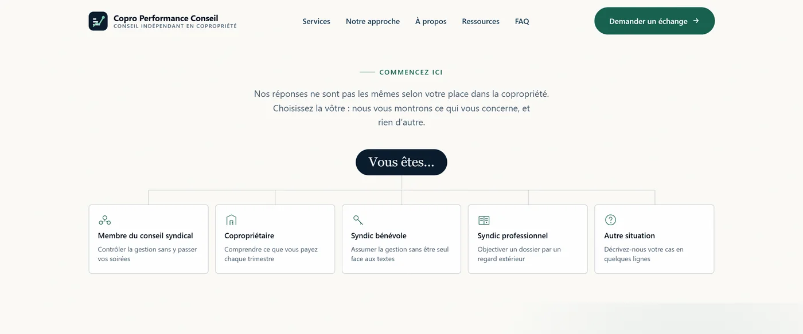
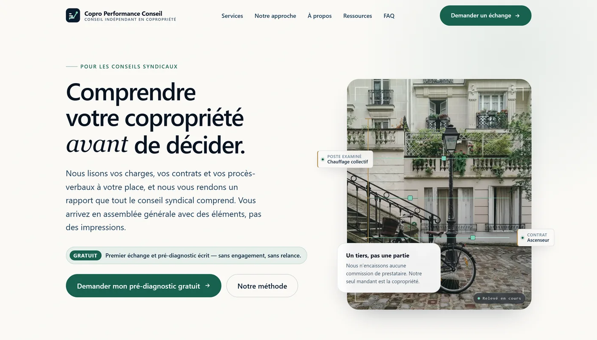
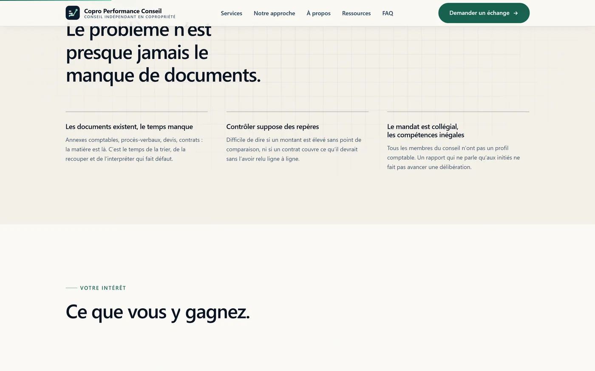
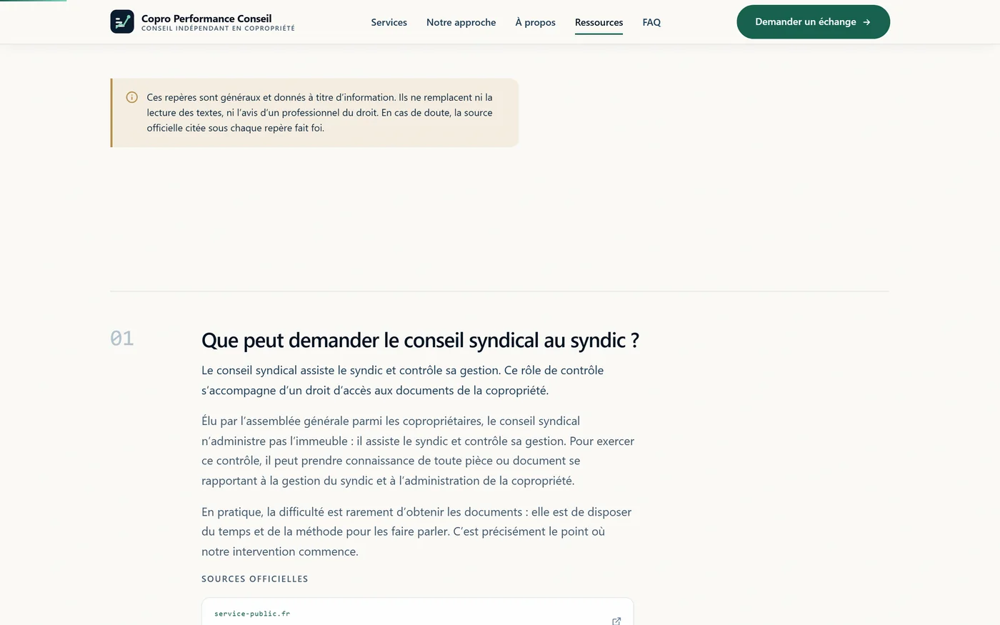
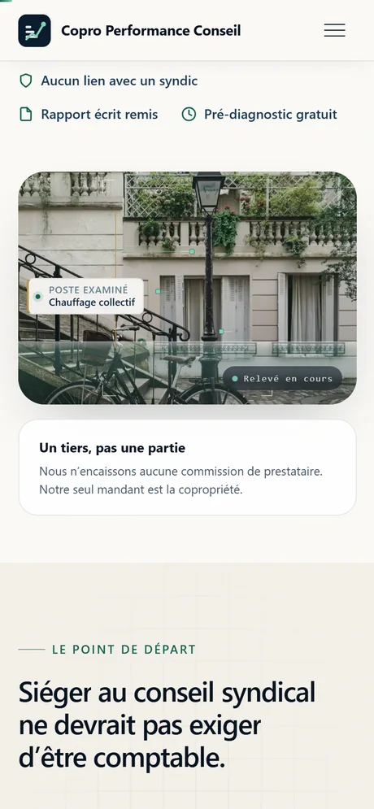

# Copro Performance Conseil — site web

Site vitrine pour un cabinet de **conseil indépendant en copropriété**.
HTML / CSS / JavaScript natifs, **aucune dépendance, aucun build**.

---

## Dépôt et mise en ligne

| | |
|---|---|
| **Site en ligne** | <https://copro-site.vercel.app> |
| **Dépôt** | <https://github.com/zdorsane/copro-performance-conseil> |
| **Projet Vercel** | `dorsanes-projects/copro-site` |
| **Déploiement** | automatique — un `git push` sur `main` met le site à jour |

Le dépôt GitHub est **connecté au projet Vercel**. Le cycle de travail se
résume donc à :

    git add -A
    git commit -m "Description du changement"
    git push

Vercel reconstruit et publie dans la foulée. Aucune commande de déploiement
à lancer à la main.

---


## Aperçu

<p align="center">
  
</p>

**L'accueil aiguille, elle n'expose plus.** Première chose vue : « Vous êtes… »
et cinq portes d'entrée. Le visiteur se qualifie lui-même et arrive sur une page
qui ne lui parle que de son cas. Ce sont de vrais liens, pas des boutons
JavaScript : crawlables, ouvrables dans un nouvel onglet, utilisables au clavier.

| | |
|:--|:--|
|  |  |
| **Le hero, sous le sélecteur.** Le calque d'architecte se dessine sur la photo — cotation en laiton, niveaux, annotations, balayage. La signature de la marque reste, la page ne fait plus que trois écrans. | **Une page profil.** Problème vécu, trois bénéfices, prestations retenues, FAQ ciblée. Le bouton final pré-remplit le formulaire : le visiteur ne redit pas qui il est. |
|  |  |
| **La page Ressources.** Six repères pour les conseils syndicaux, chacun renvoyant à sa source officielle vérifiée en HTTP 200. | **Sur mobile.** Vérifié sans débordement de 320 px à 1440 px, sur les quinze pages. |

> Toutes les animations s'effacent si le visiteur a demandé moins de mouvement
> (`prefers-reduced-motion`) : l'état final s'affiche directement, sans qu'aucun
> contenu ne soit masqué.

---

## Démarrer

Le site est statique : il suffit d'ouvrir `index.html` dans un navigateur.

Pour un aperçu dans les conditions réelles (chemins absolus, `sitemap.xml`,
`robots.txt`), lancer un serveur local :

```bash
npx serve .          # ou
python -m http.server 8000
```

Puis ouvrir <http://localhost:8000>.

> Le dossier du projet contient un `&` dans son nom. Sous Windows, si un outil en
> ligne de commande s'en étrangle, encadrer le chemin de guillemets ou utiliser
> `-LiteralPath` en PowerShell.

---

## Structure

```
.
├── index.html                      Accueil (11 sections)
├── services.html                   Prestations — Problème / Intervention / Bénéfice / CTA
├── approche.html                   Méthode en 5 étapes
├── a-propos.html                   Vision, mission, indépendance
├── conseil-syndical.html           Page profil — cible principale
├── coproprietaire.html             Page profil
├── syndic-benevole.html            Page profil
├── syndic-professionnel.html       Page profil ⚠️ cadre à confirmer
├── ressources.html                 Repères copropriété + sources officielles
├── faq.html                        FAQ complète, 4 thèmes, 21 questions
├── contact.html                    Formulaire + coordonnées
├── mentions-legales.html           ⚠️ à compléter
├── politique-confidentialite.html  ⚠️ à compléter
├── plan-du-site.html
├── 404.html
│
├── assets/
│   ├── css/style.css               Design system complet, 19 sections commentées
│   ├── css/signature.css           Calque « Le Relevé » — 14 sections commentées
│   ├── js/main.js                  ~330 lignes, vanilla, sans dépendance
│   ├── js/signature.js             ~370 lignes, vanilla, sans dépendance
│   └── img/                        SVG + og-image.jpg + icônes
│
├── robots.txt
├── sitemap.xml
├── site.webmanifest
│
├── docs/captures/                  Captures d'écran du README (hors déploiement)
│
├── CONTENU-A-VALIDER.md            ⚠️ À LIRE EN PREMIER
├── IMAGE-BRIEFS.md                 Direction artistique et briefs photo
└── README.md
```

---

## ⚠️ Avant toute mise en production

Le dossier de départ était vide. Tout le **contenu marketing** a été rédigé de
zéro ; **aucun fait n'a été inventé**.

Les données factuelles ont ensuite été alignées sur le site existant du cabinet
(`coproperformanceconseil.fr`) : domaine, e-mail, téléphone, zone d'intervention,
noms des prestations et tarifs réels.

### Déjà réglé

- ✅ Domaine réel appliqué partout (canonical, Open Graph, JSON-LD, sitemap, robots)
- ✅ Coordonnées réelles : `contact@coproperformanceconseil.fr` · `06 17 47 08 57`
- ✅ Tarifs réels : gratuit / à partir de 400 € / à partir de 80 €/mois
- ✅ Indépendance confirmée par le site du cabinet — pastilles levées

### Reste bloquant

1. **Compléter les deux pages légales.** Elles sont **obligatoires**
   (art. 6-III de la LCEN) et incomplètes : SIRET, forme juridique, directeur
   de publication, hébergeur. Le site actuel du cabinet ne les publie pas non
   plus — c'est un risque à traiter, pas à reconduire.
2. **Brancher le formulaire de contact** (voir plus bas) : il n'envoie rien.
3. **Lire `CONTENU-A-VALIDER.md`** pour les points restants.

Les éléments à confirmer sont visibles dans le site sous forme de pastilles
`À valider`. Pour les masquer pendant une démonstration :

```html
<body class="hide-flags">
```

---

## Brancher le formulaire

Le formulaire de `contact.html` **n'envoie rien** en l'état : son attribut
`action` vaut `#`. Un message d'erreur explicite s'affiche si on le soumet,
plutôt qu'un faux message de succès.

Le JavaScript gère déjà la validation, l'état de chargement, les messages de
retour, le piège à robots et le consentement RGPD. Il ne reste qu'à fournir une
destination.

### Option A — service tiers, sans serveur (le plus simple)

Créer un formulaire chez [Formspree](https://formspree.io),
[Web3Forms](https://web3forms.com) ou [Formcarry](https://formcarry.com), puis :

```html
<form class="form" data-contact-form action="https://formspree.io/f/VOTRE_ID" method="post" novalidate>
```

C'est tout : `main.js` détecte l'`action` et envoie en `fetch` + `FormData`,
en attendant une réponse HTTP 2xx.

> Vérifier que le prestataire retenu héberge dans l'UE, ou documenter le
> transfert dans la politique de confidentialité (§ 6).

### Option B — endpoint maison (PHP, Node…)

Même principe : renseigner `action` avec l'URL de l'endpoint. Celui-ci doit
accepter un `POST` multipart et répondre avec un code 2xx.

Champs envoyés : `prenom`, `nom`, `email`, `telephone`, `qualite`, `sujet`,
`lots`, `message`, `consentement`, plus `_gotcha` (champ piège — si rempli,
la requête vient d'un robot et doit être ignorée côté serveur également).

### Option C — lien e-mail uniquement

Si aucun back-end n'est souhaité dans l'immédiat, supprimer le formulaire et ne
conserver que le panneau de coordonnées, déjà présent à droite.

---

## Design system

Tout est piloté par des variables CSS dans `assets/css/style.css` (§ 01).
Changer l'identité visuelle ne demande pas de toucher au reste.

```css
:root {
  --ink-900: #071320;   /* fonds sombres          */
  --paper:   #FBFAF7;   /* fond général           */
  --accent:  #17614F;   /* vert conseil           */
  --brass:   #B9924F;   /* micro-accent premium   */
  --container: 1200px;
  --header-h: 76px;
}
```

**Typographie** — pile système (`Inter` si installée, sinon `system-ui`).
Choix délibéré : pas de Google Fonts en CDN, dont l'usage a été jugé
problématique au regard du RGPD par plusieurs autorités européennes, et qui
coûterait une requête bloquante.

Pour utiliser une police de marque, l'auto-héberger :

```css
@font-face {
  font-family: "Inter";
  src: url("../fonts/inter-var.woff2") format("woff2");
  font-weight: 100 900;
  font-display: swap;
}
```

Puis déposer le fichier dans `assets/fonts/`. La variable `--font-sans` la prend
en compte automatiquement.

**Échelle typographique** — entièrement fluide via `clamp()`. Aucun texte n'a de
taille fixe : la mise en page s'adapte de 320 px à 2560 px sans point de rupture
visible.

---

## JavaScript

`assets/js/main.js`, chargé en `defer`, sans dépendance. Quatorze modules :

| Module | Rôle |
|---|---|
| `initHeader` | État « collé » du header au scroll (rAF, listener passif) |
| `initMobileNav` | Menu mobile : ARIA, verrou du scroll, fermeture à `Échap` |
| `initStagger` | Décalage automatique en cascade des enfants |
| `initSplitText` | Découpe les titres en mots pour une révélation en cascade |
| `initReveals` | Apparitions au scroll via `IntersectionObserver` |
| `initMedia` | Photos : chargement progressif + voile de révélation |
| `initCheckLists` | Listes à puces en cascade |
| `initSteps` | Surlignage de l'étape traversée dans la méthodologie |
| `initFaq` | Accordéon accessible, ouverture par ancre `#id` |
| `initParallax` | Parallaxe douce, désactivée sous 940 px |
| `initScrollProgress` | Barre de progression de lecture en haut de page |
| `initSectionCount` | Repère de section flottant (accueil, desktop) |
| `initForm` | Validation, états, envoi, anti-spam |
| `initYear` | Année courante dans les pieds de page |

**Sans JavaScript**, le site reste lisible et navigable : seules les animations
et l'accordéon FAQ perdent leur interactivité.

### Animations au scroll

Sept effets, tous en `transform`/`opacity` uniquement, tous pilotés par
`IntersectionObserver` ou `requestAnimationFrame` avec des écouteurs passifs :

1. **Barre de progression** — filet dégradé de 2 px en haut de page
2. **Titres mot à mot** — chaque mot monte derrière un masque, en cascade
3. **Voile de révélation des photos** — un rideau se retire verticalement
4. **Chargement progressif** — miniature floutée puis fondu de la photo nette
5. **Parallaxe** — hero et bandeau photo, désactivée sous 940 px
6. **Étape active** — le numéro se colore et une barre se déploie au passage
7. **Repère de section** — pastille flottante « 04 / 07 · Pourquoi nous »

`prefers-reduced-motion: reduce` neutralise l'intégralité de ces effets sans
jamais masquer de contenu — vérifié page par page (voir « Vérifications »).

> **Le découpage des titres ne modifie pas le texte.** Chaque mot est enveloppé
> dans `<span class="w"><span class="w-i">`, les éléments inline existants
> (`.serif-em`, liens) sont préservés, et le texte restitué est identique au
> texte source. C'est contrôlé automatiquement sur les 27 titres concernés.

---

## Le calque « Le Relevé »

`assets/css/signature.css` + `assets/js/signature.js`.

### L'idée

Le cabinet lit un immeuble comme un architecte lit un plan. Toute la direction
artistique découle de cette phrase : tracés techniques, cotations, calques
d'analyse qui se dessinent, grain d'impression. C'est ce qui distingue le site
d'un modèle de cabinet de conseil — la mise en scène **est** la promesse
commerciale, jouée littéralement.

### Ce que le calque ajoute

| Élément | Où | Ce que c'est |
|---|---|---|
| **Relevé du hero** | Accueil | Un calque d'architecte se dessine sur la photo : équerres de cadrage, cotation en laiton, niveaux, points de relevé, annotations, balayage d'analyse |
| **Jeu d'illustrations** | Accueil + Services | Cinq dessins au trait créés pour le site, un par prestation, qui se tracent à l'entrée dans le champ |
| **Pile de pièces** | Accueil | Les cinq documents d'une mission, empilés puis déployés en éventail |
| **Frise défilante** | Accueil | Les pièces examinées, en bandeau continu |
| **Rail de méthode** | Accueil | Un fil vertical qui se remplit au défilement le long des cinq étapes |
| **Trame technique** | Plusieurs sections | Papier millimétré très pâle, en fond |
| **Grain** | Toutes les pages | Voile de bruit à 3 % — sensation papier plutôt qu'écran |
| **Rideau d'ouverture** | Toutes les pages | La marque se trace, **une seule fois par session** |
| **Relief au pointeur** | Cartes | Inclinaison de 3° et lueur qui suit le curseur |
| **Projecteur** | Sections sombres | Halo qui suit le curseur |
| **Boutons magnétiques** | CTA principaux | Décalage de 6 px maximum vers le curseur |
| **Compteurs** | Accueil | Chiffres animés — valeurs écrites en clair dans le HTML |

### Principes tenus

- **Aucune dépendance ajoutée.** Toujours zéro build, zéro bibliothèque.
- **Aucune règle de `style.css` modifiée.** Le calque n'ajoute que des règles
  nouvelles. Supprimer les deux lignes qui l'appellent dans le `<head>` rend le
  site à son état antérieur, intact.
- **Aucun fait inventé.** Les libellés des pièces sont ceux de la FAQ ; les
  quatre compteurs (5 prestations, 5 étapes, 1 interlocuteur, 0 commission)
  reprennent des affirmations déjà présentes sur le site.
- **Tout le décor est `aria-hidden`.** Aucune information n'est portée
  exclusivement par un élément décoratif.
- **`prefers-reduced-motion: reduce` pose l'état final**, sans rien masquer :
  pas de rideau, tracés complets, éventail déployé, chiffres justes.

### Illustrations : aucune banque d'images

Les cinq illustrations sont **dessinées à la main en SVG**, directement dans le
HTML — ce qui permet de les animer trait par trait. Elles partagent une grammaire
commune : `viewBox` de 300 × 168, trait de 1,7 px, vert de marque, laiton pour
le point relevé, trame technique en fond.

| Prestation | Ce que l'illustration montre |
|---|---|
| Audit complet | L'immeuble mis sous cotation, puis examiné à la loupe |
| Analyse des charges | La même dépense suivie d'exercice en exercice |
| Renégociation des contrats | Les pièces relues, la clause repérée, l'échéance |
| Optimisation | Les leviers classés par gain et par effort |
| Accompagnement | La table du conseil syndical, vue d'en haut |

Pour en modifier une, chercher `class="illu"` dans `index.html` ou
`services.html`. Les attributs pilotent l'animation :

- `data-draw` — le trait se dessine ; sa longueur est mesurée en JS
- `data-pop` — l'élément plein apparaît après le trait
- `data-live` — le groupe s'anime au survol de la carte
- `style="--i:N"` — l'ordre dans lequel les traits se posent

**Aucune licence à surveiller** : ces dessins n'existent nulle part ailleurs.

---

## Retour client — ce qui a été repris

Quatre demandes, traitées et mesurées.

### 1. « La page d'accueil est très longue »

Mesuré avant : **14 409 px, soit 16 écrans, sur 13 sections**. Après : **8 518 px,
9,5 écrans, 7 sections** — 41 % de moins.

Rien n'a été jeté. Les sections retirées de l'accueil ont rejoint la page où
elles ont leur place :

| Section | Devenue |
|---|---|
| « Ce que nous ouvrons » (les pièces) | `approche.html`, après les cinq étapes |
| Bandeau photo | `approche.html` |
| « Ce sur quoi vous pouvez compter » | `a-propos.html`, après l'indépendance |
| « Problématique » + « Notre rôle » | fondues en une section de trois points |
| « Pourquoi nous » | déjà traitée en détail sur `a-propos.html` |
| Frise défilante | supprimée (décorative) |

Les prestations passent de 2 à 3 colonnes : cinq cartes tiennent en deux rangées
au lieu de trois. Les étapes de la méthode utilisent la variante
`.steps--compact` sur l'accueil ; `approche.html` garde la version détaillée.

### 2. « L'intérêt n'est pas lisible » et « l'audit est gratuit »

- Le sur-titre du hero nomme désormais la cible : **« Pour les conseils syndicaux »**.
- Le sous-titre dit ce que le conseil syndical **y gagne**, plus ce que le cabinet fait.
- Une mention **Gratuit** est posée juste au-dessus du bouton (`.hero__free`) :
  c'est l'objection qu'elle lève, elle doit donc se voir avant le bouton.
- Le bouton principal devient « Demander mon pré-diagnostic gratuit ».
- Une section « Votre intérêt » remplace deux sections par trois bénéfices directs.

> **Les tarifs n'ont pas bougé.** L'audit complet reste à partir de 400 €.
> Ce qui est gratuit — et qui l'était déjà — c'est le premier échange et le
> pré-diagnostic écrit. Annoncer « audit gratuit » aurait contredit la grille
> de `services.html`, de la FAQ et des données structurées.

### 3. « Rendre tout responsive : téléphone, tablette, PC »

C'était un vrai bug, pas une impression : **la page débordait horizontalement
en dessous de 420 px**. Trois causes, aucune visible au-dessus de 768 px.

1. **`min-width: auto` sur les éléments de grille.** Un `<select>` prend la
   largeur de sa plus longue option — ici « Un accompagnement du conseil
   syndical ». Il élargissait son champ, puis le formulaire, puis la page.
2. **Chaînes insécables.** `contact@coproperformanceconseil.fr` mesure 261 px
   et ne comporte aucun point de césure.
3. **Les révélations latérales.** `[data-reveal="right"]` décale l'élément de
   26 px *en attendant* d'être déclenché : tout bloc encore sous la ligne de
   flottaison poussait la page vers la droite.

Correctifs dans `style.css` § 16 bis. Ajouté au passage : champs à 16 px sous
640 px (en deçà, iOS zoome au focus), cibles tactiles à 44 px, boutons pleine
largeur sur mobile.

**Vérifié : aucun débordement sur les 11 pages, à 320 / 360 / 390 / 414 / 768 /
1024 / 1440 px.**

### 4. Page « Ressources »

`ressources.html` : six repères pour les conseils syndicaux, chacun renvoyant à
sa source officielle. Ajoutée à la navigation, au menu mobile, au plan du site
et au `sitemap.xml`, avec ses propres données structurées (`CollectionPage` +
`ItemList`).

**Chaque lien externe a été testé en HTTP 200 avant d'être écrit.** Les six
fiches `service-public.fr` retenues ont été trouvées par balayage et vérifiées
une par une — plusieurs identifiants plausibles renvoyaient un 404, ou une page
sans rapport avec la copropriété.

> **Legifrance ne figure pas dans les sources.** Le site renvoie 403 à toute
> requête automatisée, y compris sur sa racine : ses liens profonds n'ont pas pu
> être vérifiés. Les textes sont donc cités par leur nom, sans lien. À ajouter à
> la main si vous les vérifiez vous-même.

#### Sur l'effet SEO attendu

Une précision utile, parce que l'attente exprimée repose sur un malentendu
courant : **les liens sortants vers des sites .gouv.fr n'apportent pas de
référencement.** Le « jus » SEO circule des liens *entrants* vers votre site,
pas l'inverse. Citer des sources officielles sert la **crédibilité** et la
cohérence thématique — ce qui compte — mais ne fait pas venir Google.

Ce qui amènera réellement du trafic sur cette page :

1. **Le contenu lui-même**, qui répond à des questions réellement tapées
   (« que peut demander le conseil syndical au syndic », « comment lire les
   charges de copropriété »). C'est là qu'est la valeur de la page.
2. **Le retrait du `noindex`.** Tant que l'en-tête `X-Robots-Tag: noindex,
   nofollow` reste dans `vercel.json`, **cette page ne sera jamais indexée** et
   tout le reste est sans effet. C'est le point bloquant numéro un.
3. **La soumission du `sitemap.xml`** dans la Google Search Console, une fois le
   domaine réel branché.

---


## L'accueil comme aiguillage

Demande du client : *« la page d'accueil doit être minimaliste, vu que l'on
redirige le trafic sur différentes pages en fonction du type de personne »*.

### Ce que ça donne

**2 925 px, 3,3 écrans**, contre 14 409 px et 16 écrans au point de départ —
**80 % de moins**. Trois blocs, dans cet ordre :

1. **Le sélecteur** « Vous êtes… », cinq portes d'entrée
2. **Le hero** et son calque de relevé
3. **Une bande de clôture** : les cinq prestations en liste, la gratuité, un bouton

Ont quitté l'accueil : les cartes de prestations, la grille tarifaire, la
méthode, la FAQ et la section « Votre intérêt ». Tout existe sur `services.html`,
`approche.html`, `faq.html` et sur les pages profil.

### Pourquoi de vraies pages, et pas un filtre JavaScript

| | Vraies pages | Filtre JS |
|---|---|---|
| Référencement | chaque page vise ses requêtes | tout reste sur `/` |
| Lien partageable | oui | non |
| Sans JavaScript | fonctionne | rien ne s'affiche |
| Mesure | on sait quel profil convertit | invisible |

Les cinq cartes sont des `<a href>`. Aucune ne dépend du JavaScript.

### Les quatre pages profil

| Page | Angle d'attaque | Prestations retenues |
|---|---|---|
| `conseil-syndical.html` | Contrôler sans y passer ses soirées | 4 |
| `coproprietaire.html` | Comprendre son appel de fonds | 2 |
| `syndic-benevole.html` | Ne pas être seul face aux textes | 3 |
| `syndic-professionnel.html` | Objectiver un dossier | 3 |

Chacune attaque par un problème **réellement distinct** et propose un
sous-ensemble différent de prestations. C'est la condition pour que Google ne
les lise pas comme des quasi-doublons et n'en garde qu'une.

**Le bouton final pré-remplit le formulaire** : `contact.html?profil=…`
sélectionne la qualité correspondante. Le visiteur a déjà dit qui il était en
page d'accueil ; le lui redemander serait une question de trop. Une valeur d'URL
inconnue est ignorée — un paramètre d'URL est une saisie extérieure, jamais une
consigne.

### ⚠️ Le point à trancher : « syndic professionnel »

Ajouter ce profil met en tension le positionnement du site. **Neuf affirmations
deviennent fausses** si un syndic peut vous mandater et vous rémunérer :

| Où | Affirmation |
|---|---|
| `index.html` | « Aucun lien avec un syndic » (hero) |
| `index.html` | « Un tiers, pas une partie » · « Notre seul mandant est la copropriété » |
| `index.html` ×2 | « rémunérés uniquement par la copropriété qui nous mandate » (FAQ + JSON-LD) |
| `approche.html` | « La copropriété nous mandate et nous rémunère. Personne d'autre. » |
| `a-propos.html` | « Un seul mandant : la copropriété. » |
| `faq.html` | « rémunérés uniquement par la copropriété qui nous mandate » |

**Rien n'a été réécrit.** La page `syndic-professionnel.html` a été rédigée avec
le seul cadrage qui ne contredit aucune de ces phrases :

> Le syndic est **à l'origine** de l'intervention et en est l'interlocuteur ;
> le **syndicat des copropriétaires reste le mandant** et le payeur.

C'est aussi le cadrage qui rend le service vendable : un constat n'a de valeur
pour un syndic que s'il est perçu comme neutre par le conseil syndical.

La page porte une pastille **À valider** sur ce point. Deux suites possibles :

- **Ce cadrage est le bon** → retirer la pastille, rien d'autre à faire.
- **Vous entendez être payé directement par des syndics** → les neuf phrases
  ci-dessus doivent être réécrites. La formulation qui resterait vraie :
  *« Nous n'appartenons à aucun groupe de gestion immobilière et ne percevons
  aucune commission de prestataire »* — l'indépendance devient financière et
  structurelle, plus relationnelle.

---


## Accessibilité

Conçu en visant WCAG 2.1 niveau AA :

- Structure sémantique (`header`, `nav`, `main`, `section`, `article`, `footer`)
- Lien d'évitement, `aria-current`, `aria-expanded`, `aria-controls`, `role="region"`
- Navigation clavier complète, `:focus-visible` visible sur fond clair et sombre
- Contrastes vérifiés sur les deux fonds
- `prefers-reduced-motion` respecté : toutes les animations sont neutralisées
- `alt` sur chaque image porteuse de sens, `alt=""` sur le décoratif
- Zones tactiles ≥ 44 px, formulaire entièrement étiqueté

---

## SEO

- `<title>` et `<meta name="description">` uniques par page
- `<link rel="canonical">` sur chaque page
- Open Graph + Twitter Card complets, image 1200 × 630 fournie
- JSON-LD : `ProfessionalService`, `FAQPage` (×2), `HowTo`, `BreadcrumbList`, `ContactPage`
- `sitemap.xml` et `robots.txt`
- Fil d'Ariane sur les pages intérieures
- Un seul `<h1>` par page, hiérarchie de titres continue
- Maillage interne entre accueil, services, approche et FAQ

**Intentions de recherche visées** : conseil copropriété · audit copropriété ·
analyse charges copropriété · conseil syndical · optimisation charges copropriété ·
accompagnement conseil syndical · analyse contrats copropriété.

Ces expressions sont intégrées naturellement dans les titres, les questions de
FAQ et le corps de texte — sans bourrage.

---

## Photographies

Trois photographies **CC0** (domaine public, usage commercial libre) issues de
Wikimedia Commons, sélectionnées après examen visuel de quatorze candidates.
Onze ont été écartées : architecture non française, personne identifiable,
bâtiment dégradé, colorimétrie incompatible.

Chacune est déclinée en `.webp` (servi en priorité), `.jpg` (repli) et
`-tiny.jpg` (miniature floutée pendant le chargement). Toutes sous 170 Ko.

Sources tracées dans [`CREDITS-PHOTOS.md`](CREDITS-PHOTOS.md), procédure de
remplacement dans [`IMAGE-BRIEFS.md`](IMAGE-BRIEFS.md).

**Aucune photographie de personne** n'est utilisée, et aucune ne doit l'être
sans accord écrit de la personne concernée.

---

## Performance

- Aucune dépendance externe : zéro requête tierce
- CSS ~46 Ko, JS ~19 Ko, non minifiés (lisibles pour la maintenance)
- Photos en WebP avec repli JPEG, toutes sous 170 Ko
- `width`/`height` sur toutes les images → CLS proche de zéro
- `fetchpriority="high"` sur le seul visuel du hero, `loading="lazy"` ailleurs
- Animations en `transform` et `opacity` uniquement, listeners de scroll passifs et throttlés en `requestAnimationFrame`

**Avant mise en production** : minifier CSS et JS, activer gzip/brotli côté
serveur, servir en HTTP/2, et poser des en-têtes de cache longs sur `/assets/`.

---

## Déploiement en cours

Le site est en ligne sur Vercel, en accès public.

### Lien à transmettre au client

**https://copro-site.vercel.app**

C'est l'URL stable du projet : elle pointe toujours vers le dernier déploiement
de production. À privilégier sur les URL longues à identifiant
(`copro-site-xxxxxxx-dorsanes-projects.vercel.app`), qui sont figées sur un
déploiement précis et deviennent obsolètes à la mise à jour suivante.

| Élément | Valeur |
|---|---|
| Projet Vercel | `dorsanes-projects/copro-site` |
| URL stable | `https://copro-site.vercel.app` |
| Cible | production |
| Protection SSO | désactivée (sinon le client tombe sur une page de connexion) |
| Indexation | **bloquée** via `X-Robots-Tag: noindex, nofollow` |

### Deux points avant de brancher le vrai domaine

**1. Retirer le `noindex`.** Il se trouve dans `vercel.json`, bloc
`"source": "/(.*)"`. Il évite que l'URL `.vercel.app` soit indexée en doublon de
`coproperformanceconseil.fr`, ce qui pénaliserait le référencement. Une fois le
domaine réel branché, supprimer cette entrée et redéployer — sinon **le site ne
sera jamais référencé**.

**2. `coproperformanceconseil.fr` sert déjà un autre site.** Brancher le domaine
sur Vercel le remplacera. À ne faire qu'une fois les mentions légales complétées.

### Brancher le domaine réel

    vercel domains add coproperformanceconseil.fr
    vercel alias set copro-site.vercel.app coproperformanceconseil.fr

Puis chez le registrar :

| Type | Nom | Valeur |
|---|---|---|
| A | `@` | `76.76.21.21` |
| CNAME | `www` | `cname.vercel-dns.com` |

### Redéployer après modification

Deux voies, selon que le dépôt Git est branché sur Vercel ou non.

**Voie 1 — automatique (recommandée).** Si le dépôt GitHub est connecté au
projet Vercel, un `git push` sur `main` déclenche seul un déploiement de
production. Rien d'autre à faire.

**Voie 2 — manuelle, via le CLI.** Le déploiement se fait depuis une **copie**
du dossier : le `&` de `client&` fait échouer le CLI Vercel sans message
d'erreur explicite.

    DEPLOY=C:/Users/DELL/AppData/Local/Temp/copro-deploy
    rm -rf "$DEPLOY" && mkdir -p "$DEPLOY"
    cp -r *.html *.txt *.xml *.webmanifest vercel.json .vercelignore assets README.md "$DEPLOY/"
    cd "$DEPLOY"
    vercel link --yes --project copro-site
    vercel deploy --prod --yes

Vérifier ensuite que la mise à jour est bien en ligne :

    curl -s https://copro-site.vercel.app | grep -c signature.css

---

## Déploiement — autres hébergeurs

Un hébergement statique suffit — aucun PHP, aucun Node côté serveur.

| Plateforme | Marche à suivre |
|---|---|
| **Netlify** | Glisser-déposer le dossier, ou connecter un dépôt Git |
| **Vercel** | `vercel --prod` à la racine |
| **GitHub Pages** | Pousser sur une branche, activer Pages dans les réglages |
| **OVH / Infomaniak / o2switch** | Envoyer le contenu du dossier en FTP dans `www/` |

Points à ne pas oublier :

1. Activer **HTTPS** (Let's Encrypt est gratuit chez tous ces hébergeurs)
2. Rediriger `http://` → `https://` et forcer une seule version du domaine (avec ou sans `www`)
3. Configurer la page d'erreur 404 vers `404.html`
4. Renseigner l'hébergeur dans les mentions légales — c'est une obligation légale
5. Soumettre `sitemap.xml` dans la Google Search Console

---

## Faire évoluer le site

Le contenu a été volontairement conçu pour tenir **sans preuves chiffrées**.
Quand le cabinet disposera de matière réelle, ces ajouts s'intègrent sans refonte :

| Ajout | Où |
|---|---|
| Témoignages clients (avec accord écrit) | Nouvelle section entre « Engagements » et « FAQ » sur l'accueil |
| Chiffres réels (missions, ancienneté) | Section « Engagements » de l'accueil, en remplacement ou complément |
| Études de cas anonymisées | Nouvelle page `realisations.html`, à ajouter au menu et au sitemap |
| Blog / ressources | Dossier `/ressources/` — excellent levier SEO sur les requêtes longue traîne |
| Grille tarifaire | Page `services.html`, après chaque bloc de prestation |
| Portrait du fondateur | `a-propos.html`, section actuellement en attente |

---

## Choix techniques assumés

**Pourquoi du HTML statique plutôt que Next.js ou WordPress ?**
Un site vitrine de neuf pages n'a pas besoin d'un framework. Ce choix apporte :
zéro dépendance à mettre à jour, zéro faille applicative, un chargement
quasi instantané, un hébergement à coût nul ou négligeable, et un contrôle total
du balisage SEO. Le contenu est structuré pour être repris tel quel dans un CMS
si le besoin se présente.

**Pourquoi des pastilles « À valider » visibles dans le site ?**
Pour qu'aucune affirmation non vérifiée ne parte en production par inadvertance.
Elles se retirent en une ligne (voir plus haut).

**Pourquoi pas de bandeau cookies ?**
Parce que le site n'en dépose aucun. Ajouter un bandeau alors qu'il n'y a rien à
consentir dégraderait l'expérience sans bénéfice juridique. Si un outil de
statistiques est ajouté plus tard, la question se reposera — la politique de
confidentialité le documente déjà (§ 7).
